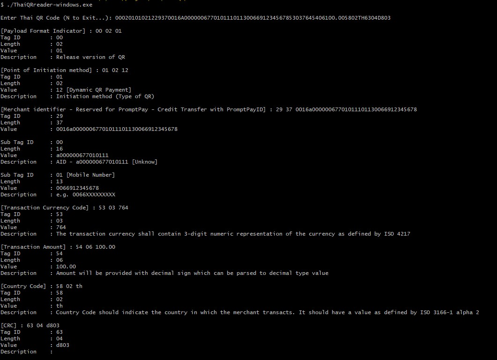
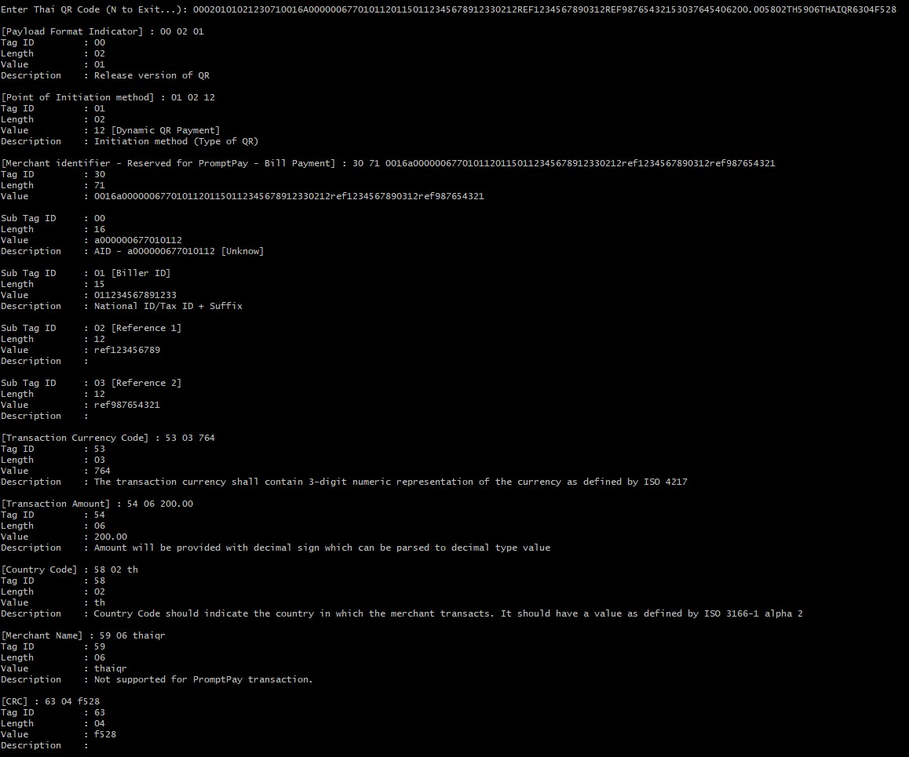
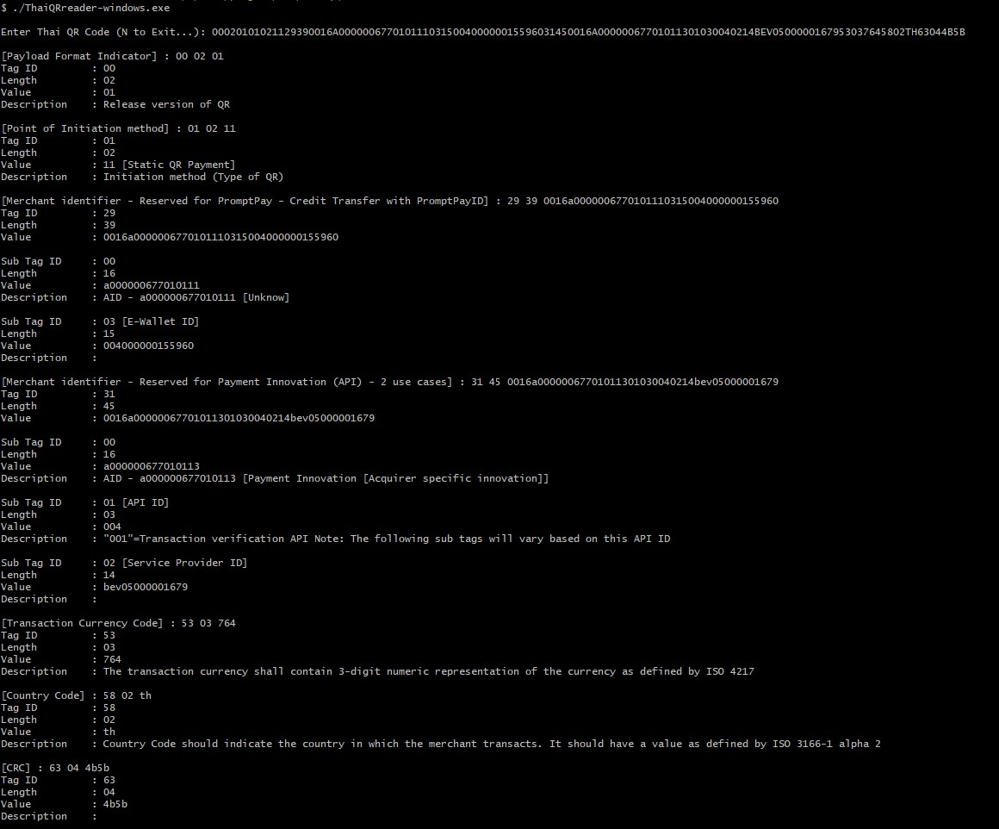

# Thai QR Code Payment Reader (2023-07-18)
# Releases
* **2023-07-18** Release version 1.0.0 support tag29, tag30, tag31

# Getting started
### Installing
To install project, you need to clone the project by following command below:

```bash
$ git clone https://<Username>:<Personal access token>@github.com/navamin11/thaiQR-Reader.git thaiQR
```
# Running project
### Run this command to start application or build application
```bash
$ make run
```
or
```bash
$ make build
```
Note : After build, Please check binary file to bin

# Example read Thai QR Code
### QR Tag29 : Dynamic code
<p align="center"></p>

### QR Tag30 : Dynamic code
<p align="center"></p>

### QR Tag29 and Tag31 : Static code
<p align="center"></p>

### Dowload Application
* **For Windows**
https://drive.google.com/file/d/1D8J1FdNt6UhQtxxWh94Jy5o8_Fc0yDuy/view?usp=sharing

* **For Mac**
https://drive.google.com/file/d/1mAK8vcs5RT5Is3cdJGX115ghU_3hVhmr/view?usp=drive_link

* **For Linux**
https://drive.google.com/file/d/1mAK8vcs5RT5Is3cdJGX115ghU_3hVhmr/view?usp=drive_link